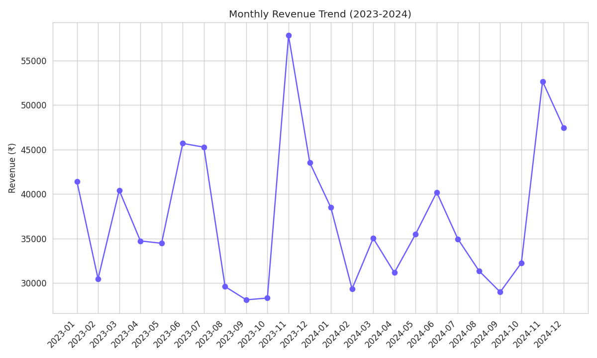
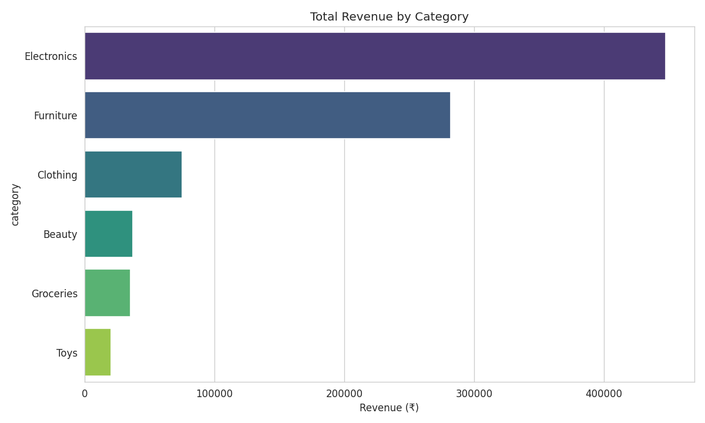
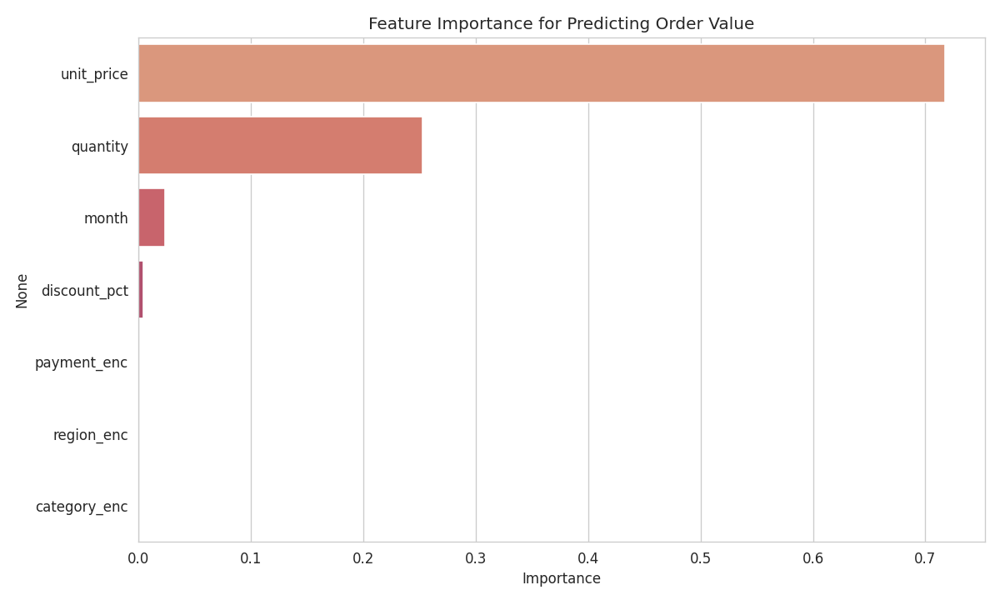

# Real-World Data Project — Retail Sales Analysis & Forecasting

**Domain:** Retail
**Type:** End-to-end Data Analysis + Predictive Modeling

## Overview
This project applies data science techniques to a retail sales dataset, performing
exploratory data analysis (EDA), visualization, and building a machine learning model
to predict order value — simulating a real business analytics use case.

## Dataset
A synthetic but realistic retail transactions dataset (`data/retail_sales.csv`) with
3,000 orders across 2023–2024, including:
- `order_id`, `order_date`
- `category` (Electronics, Clothing, Groceries, Furniture, Toys, Beauty)
- `region` (North, South, East, West)
- `payment_mode` (Credit Card, Debit Card, UPI, Cash)
- `unit_price`, `quantity`, `discount_pct`, `net_amount`

> Generated with `generate_dataset.py` using realistic price ranges and a holiday
> seasonality boost (Nov–Dec), so trends mirror real-world retail patterns.

## What This Project Does

### 1. Data Cleaning
- Checked for missing values and duplicates
- Parsed dates, extracted month/year/weekday features

### 2. Exploratory Data Analysis
- Monthly revenue trend (shows holiday season spikes)
- Revenue by category and region
- Payment mode distribution
- Discount % impact on order value
- Revenue by day of week

### 3. Key Business Insights
- Total revenue, average order value
- Best-performing category and region
- Holiday season (Nov–Dec) contribution to total revenue

### 4. Predictive Modeling
A **Random Forest Regressor** predicts `net_amount` (order value) from order
features (category, region, payment mode, price, quantity, discount, month).

**Results:**
- R² Score: **0.995**
- Mean Absolute Error: **₹13.74**

Feature importance and predicted-vs-actual plots are included to interpret the model.

## Project Structure
```
CodeAlpha_RetailSalesAnalysis/
├── generate_dataset.py     # Creates the synthetic dataset
├── analysis.py             # Full EDA + visualization + ML pipeline
├── requirements.txt
├── data/
│   └── retail_sales.csv
├── images/                 # All generated charts
│   ├── monthly_revenue_trend.png
│   ├── revenue_by_category.png
│   ├── revenue_by_region.png
│   ├── payment_mode_distribution.png
│   ├── discount_vs_amount.png
│   ├── revenue_by_weekday.png
│   ├── feature_importance.png
│   └── predicted_vs_actual.png
└── README.md
```

## How to Run

```bash
pip install -r requirements.txt
python generate_dataset.py   # creates data/retail_sales.csv
python analysis.py           # runs EDA + model, saves charts to images/
```

## Tech Stack
- Python, pandas, numpy
- matplotlib, seaborn (visualization)
- scikit-learn (Random Forest model)

## Sample Visualizations





## Notes for Submission
- Push this folder to a GitHub repo named **CodeAlpha_RetailSalesAnalysis**
  (or rename per your program's naming convention, e.g. `Thiranex_RetailSalesAnalysis`)
- Record a short video walking through the dataset, EDA findings, and model results
- Submit the repo link as required by your internship task
